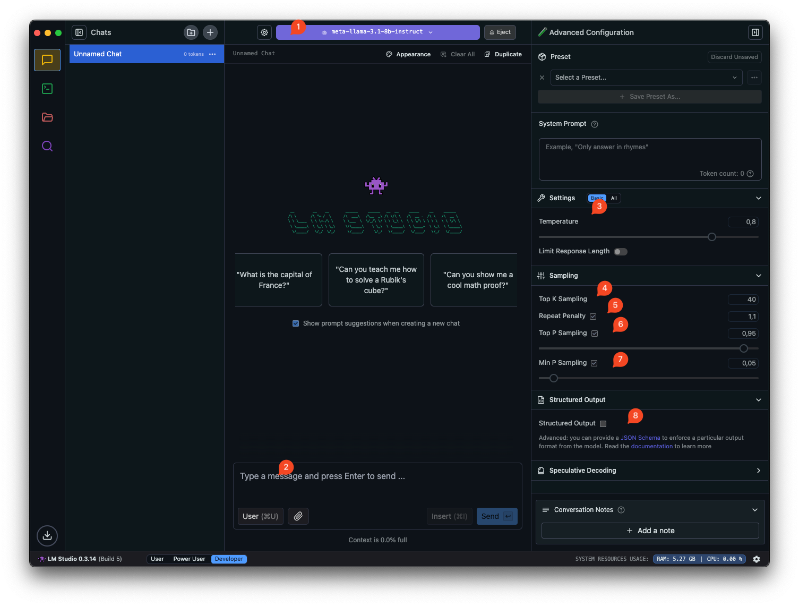

# Prompt Engineering Guide

This prompt engineering guide aims to spread knowledge among team members in our company to establish a common understanding and encourage application in different use cases. From programming to preparing account responses, these techniques will improve development processes in enterprise applications.

## What is Prompt Engineering?

Prompt engineering is the process of designing effective inputs for language models to generate desired outputs. It's about learning to communicate effectively with AI models by structuring your requests in ways that elicit the most useful responses.

### LLM Models

// TODO

### What is Prompt Engineering?

Prompt engineering is the process of designing effective inputs for language models to generate desired outputs. It's about learning to communicate effectively with AI models by structuring your requests in ways that elicit the most useful responses.

### Why is Prompt Engineering Important?

- **Enhance Output Quality**: Get more accurate, relevant, and useful responses
- **Control AI Behavior**: Guide the model's reasoning and response style
- **Optimize Task Performance**: Improve results for specific applications
- **Reduce Hallucinations**: Minimize fabricated or incorrect information

## Getting Started

Start with the [Prerequisites](prerequisites.md) guide to set up the necessary tools for your prompt engineering practice. Most of examples below have using the Utils that does exist.

### Playground

A playground is a system for designing prompts and testing results. For example, you can use LM Studio with your loaded model based on your requirements. Below is the LM Studio interface:

Key areas in the LM Studio interface:

1. **Model Selection** - Choose which LLM to use for your prompt engineering
2. **Message Input** - Area to type your prompts and messages
3. **Settings Panel** - Configure various model parameters
4. **Top-k Sampling** - Controls diversity by limiting token selection to top k options
5. **Repeat Penalty** - Prevents repetitive text by penalizing already generated tokens
6. **Top-p Sampling** - Uses probability distribution to select tokens (nucleus sampling)
7. **Min-p Sampling** - Sets minimum probability threshold for token selection
8. **Structured Output** - Configure JSON output format for structured responses

## Resources

- [Prompt Engineering Guide](https://www.promptingguide.ai/)
- [LM Studio Documentation](https://lmstudio.ai/docs)

[Back to Main Page](../index.html)
